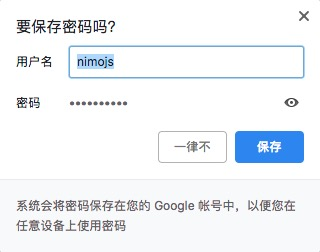
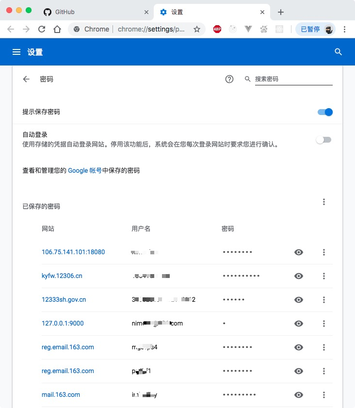

# safety-spec

> 安全手册

## 业务人员

一、**工作电脑务必设置密码**，密码轻易不透露给其他员工和公司以外的人。如应紧急情况将密码透露给其他人，请及时修改密码。

二、 在自己**工作电脑之外的电脑登录账号**时，请注意**不要选择保存密码**。保存后的密码是可以通过技术手段或流量密码管理查看。

**提示保存密码**

> 

**密码管理器**
> 

三、在**丢失手机或电脑设备时**，应**立即联系（移动/联通/电信）要求暂时禁用手机卡**，并申请将公司所用通讯账号暂时封禁（微信/qq）。并告知系统平台相关人员，**修改平台账户密码**。

四、一切工作安排与沟通方式均按照公司规定执行，当收到**可疑邮件/短信/电话时应该提高警惕与相关人员核实**。（邮件和短信都可以做到伪造发件邮箱/手机号码）

五、工作所需的平台账号密码，如需记录，务**记录在有解锁密码措施的文档中**。解锁密码不可以告诉任何人。

六、账号密码不允许设置过于简单，比如

```shell
用户名    | 密码
zhangsan | zhangsan123
zhangsan | mima
zhangsan | password
admin    | 123456
zhangsan | a19900229
# 这类密码都是根据公司公开信息找到联系人，通过穷举的方式破解的密码
```

### 开发人员

一、自己的**代码版本控制（git/svn）账号不允许透露给其他开发人员**，开发账号统一由管理员分配权限。公司提供的版本控制账号密码均可自主找回修改，不存在自己的账号忘了必须使用其他同事账号的情况。

二、公钥，私钥、pem证书等不允许透露给没有相关权限的同事和他人。

三、公司项目的管理平台均要求密码+短信验证码双重校验登录。（登录需要发送并提交手机验证码）

四、不允许将数据库/接口的账号密码存放在代码版本控制中，存放在配置文件中。配置文件不加入代码版本控制，由运维在服务器中创建配置文件。（`config/db.php`）

五、不得将公司项目代码上传到公开网站中 (github/gitlab/CSDN)

六、无论是测试机还是正式机管理后台账号均每个人管理自己的，不要出现多个人同时使用同一个 admin 账号。
